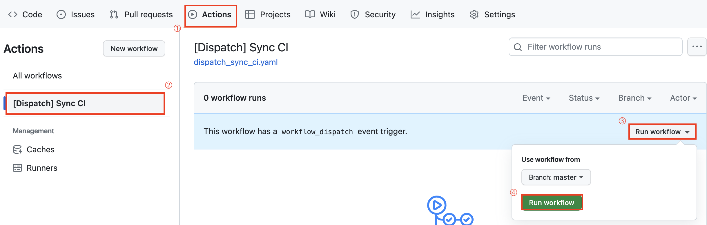
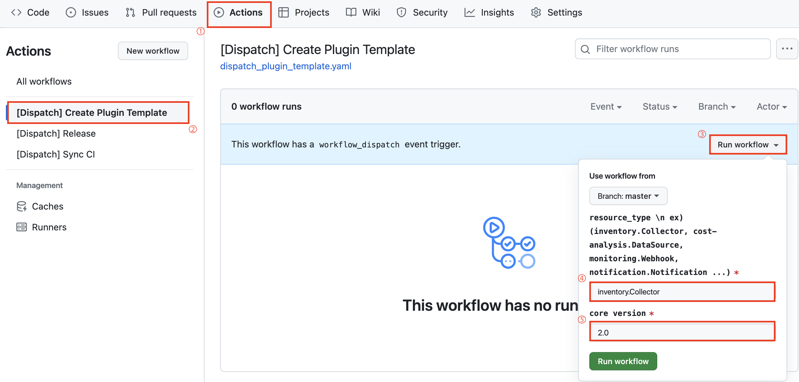
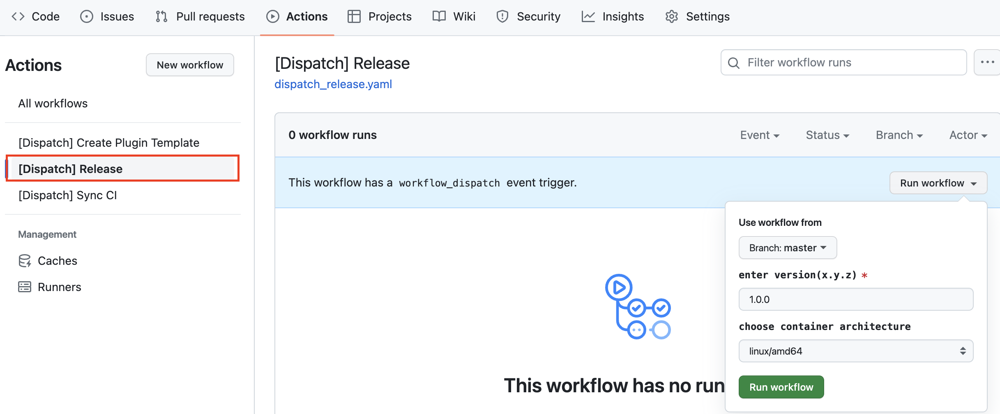

# Getting Started

[1. Dispatch git actions](#1-dispatch-git-actions) <br>
[2. Create plugin template with git actions](#2-create-plugin-template-with-git-actions) <br>
[3. Run plugin server](#3-run-plugin-server) <br>
[How to build plugin container image](#how-to-build-plugin-container-image) <br>
[How to test plugin](#how-to-test-plugin) <br>


---

## 1. Dispatch git actions
First, you need to sync your repository with Forest-extension workflows.

- Sync your repository with Forest-extension workflows. follow 1~4 steps.


<br>

## 2. Create plugin template with git actions 

Dispatch `Create Plugin Template` workflow. follow and just click *1~3* steps. <br>
Choose your  `resource_type` one of below at *4th* step.
- inventory.Collector
- cost-analysis.DataSource
- monitoring.DataSource
- monitoring.Webhook
- notification.Notification
- identity.ExternalAUth

At *5th* step, you can input Cloudforet's core package version. <br>
You can check the latest version at [here](https://pypi.org/project/spaceone-core/).



<br>

## 3. Run plugin server
Before running plugin server, you need to install some packages.
- Install spaceone-core package
```commandline
$ pip install --upgrade spaceone-core
```
- Install spaceone core application packages. It depends on your `resource_type`.
   - inventory.Collector -> spaceone-inventory
   - cost-analysis.DataSource -> spaceone-cost-analysis
   - monitoring.DataSource -> spaceone-monitoring
   - monitoring.Webhook -> spaceone-monitoring
   - notification.Notification -> spaceone-notification
   - identity.ExternalAUth -> spaceone-identity

```commandline
$ pip install --pre --upgrade spaceone-inventory
```
Now, you are ready to run plugin server. 
Let's run plugin server with this command below.
```commandline
$ spaceone run plugin-server plugin -s ./src
```

<br>

## How to build plugin container image
We recommend you to use our git actions to build plugin container image.

You can just click `Actions` tab and click `Run workflow` button.
then you can see container image in your repository's `packages` folder.



If you want to build plugin container image manually, follow this step.
```commandline
$ docker build -t <image_name>:<tag> .
```

<br>

# How to test plugin
You need to install spacectl to test plugin.
```commandline
$ pip install --upgrade spacectl
```